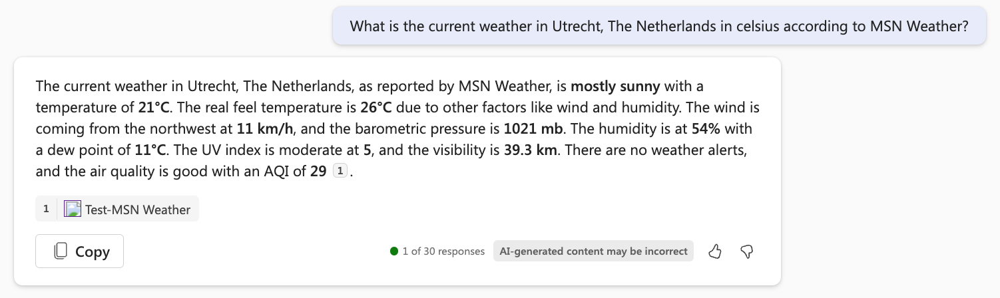

# Exercício: criar uma ação de conector

Neste exercício, você vai:

- Criar uma ação do conector no Copilot Studio
- Testar a ação do conector no Microsoft Teams
- Salvar e publicar a ação do conector

## Tarefa 1: criar uma ação do conector no Copilot Studio

Nesta tarefa, você configurará uma ação do conector para o conector do MSN Clima.

1. Se solicitado, abra o [Copilot Studio](https://copilotstudio.microsoft.com) e entre em sua conta corporativa ou de estudante. Ignore as mensagens de boas-vindas.

    **Observação:** na primeira vez que você abrir o Copilot Studio, poderá aparecer uma interface de bate-papo para criar seu primeiro copiloto. Se isso acontecer, clique no menu **...** no canto superior direito (ao lado do botão **Criar**), selecione **Cancelar criação do copiloto** para sair da interface de bate-papo e exibir a home page do Copilot Studio.
1. Selecione **Biblioteca** na navegação à esquerda. Aqui, você pode exibir uma lista de ações e conectores existentes e criar um novo.
1. Selecione **Adicionar um item** na parte superior.  Um menu lista duas opções para estender o Copilot para Microsoft 365.
:::image type="content" source="../Media/extend copilot options.png" alt-text="A janela lista duas opções para estender o Copilot: criar um copiloto ou criar uma ação.":::
2. Selecione **Nova ação**.
3. Selecione **Conector** para abrir o assistente das ações do conector.
4. Selecione **MSN Clima** como o conector.
5. **Revise** a descrição.

    > [!IMPORTANT]
    > Essa descrição é muito importante porque o Copilot a usará para combinar a mensagem do usuário com o seu plug-in. Se a descrição não for boa, pode ser que o Copilot não dispare a ação do conector.

1. Selecione **Avançar**.
1. Selecione a ação **Obter previsão atual**.
1. **Revise** a descrição da ação.

    > [!IMPORTANT]
    > Revise a descrição da ação na tela a seguir. Essa descrição da ação é muito importante porque o Copilot a usará para corresponder a mensagem do usuário à sua ação. Se a descrição da ação não for boa, talvez o Copilot dispare a ação errada.

1. Selecione **Avançar**.
1. **Revise** as descrições de todas as entradas e saídas.

    > [!IMPORTANT]
    > Revise as descrições de entrada e saída na tela a seguir. Essas descrições de entrada e saída são muito importantes porque o Copilot as usará para disparar o conector (entradas) e para escrever uma boa resposta (saídas) para você. Se as descrições de entrada e saída não forem boas, o Copilot pode não acionar o conector corretamente ou não enviará uma resposta boa.

1. Selecione **Avançar**.
1. Em seguida, você verá uma tela onde poderá adicionar mais ações, se desejar, mas, neste caso, pularemos isso e clicaremos em **Avançar**.

## Tarefa 2: testar a ação do conector no Microsoft Teams

Nesta tarefa, você testará a ação do conector configurada na tarefa 1 no Microsoft 365 Copilot no Microsoft Teams.


1. Escolha uma conexão existente se tiver uma ou selecione **Nova conexão** para criar uma nova para o conector do MSN Clima.
1. No menu **Nova conexão**, clique em **Criar**.
1. Em **Conexão selecionada**, agora você pode selecionar sua nova conexão no menu suspenso.
1. Clique no botão **Testar ação**.

    > [!NOTE]
    > Isso disparará um processo em que a ação do conector será implantada no Microsoft Teams para que você possa testá-la.

1. Clique em **Abrir para testar** para testar.

    > [!NOTE]
    > Isso abrirá uma nova guia do navegador e tentará iniciar o Microsoft Teams.

1. Se quiser, clique em **Cancelar** no pop-up onde ele tenta iniciar o Microsoft Teams.
1. Clique em **Usar o aplicativo Web**.

    > [!NOTE]
    > Isso abrirá o Microsoft 365 Copilot no Microsoft Teams.

1. Na área de composição de mensagens no Copilot no Teams, clique no ícone do **plug-in** ao lado do ícone de envio.
1. Localize o plug-in **Test-MSN Weather** e clique na alternância para habilitá-lo.

    > [!NOTE]
    > A seguinte mensagem será exibida.

    


1.  Envie a seguinte mensagem para o Microsoft 365 Copilot, preenchendo os valores para o local e as unidades desejadas.

    ```text
    What is the current weather in <your location> in <celsius/fahrenheit> according to MSN Weather?
    ```

1. Se tudo correr bem, o Copilot responderá com uma mensagem usando o plug-in.  

   

   **Observação:** o Copilot pode solicitar permissão antes de usar o plug-in.  Selecione **Permitir sempre** para habilitar o Copilot para usar o plug-in.

   :::image type="content" source="../Media/test-msn-weather-allow.png" alt-text="Captura de tela do Copilot solicitando permissão para usar o plug-in.":::

## Tarefa 3: salvar e publicar a ação do conector

Nesta tarefa, você salvará a ação do conector e a publicará.

Vamos continuar de onde paramos no Copilot Studio.

1. Clique em **Avançar** no assistente e a ação do conector será publicada.

    > [!NOTE]
    > Na próxima tela, você poderá ir para a tela de detalhes ou salvar e fechar. Conforme indicado na mensagem, pode levar alguns minutos para que a ação apareça nas experiências do copiloto.

      
   
1. Selecione **Salvar e Fechar**.

Você configurou e publicou sua ação do conector.
